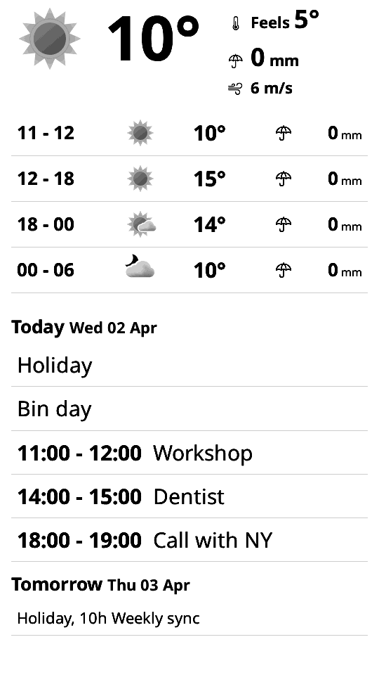

# m5paper-dashboard

A weather and calendar dashboard for the [M5Paper](https://docs.m5stack.com/en/core/m5paper)
(ESP32, 4.7" 540×960 e-ink).

<p align="center">
  
</p>

A small Flask service renders an HTML dashboard, takes a screenshot of it with headless Chromium
and serves it as a 16-level grayscale PNG. The M5Paper wakes up every hour, downloads the PNG,
displays it and goes back to sleep.

- **Weather:** [MET Norway Locationforecast](https://api.met.no/weatherapi/locationforecast/2.0/documentation)
  (current conditions plus three 6-hour blocks, including a "feels like" temperature).
- **Calendar:** any iCalendar feed, e.g. a Google Calendar secret address (events for today and
  tomorrow, recurring events expanded).

```
M5Paper ──GET /──▶ Flask ──▶ Chromium screenshot of /dashboard ──▶ grayscale PNG
                            ├─ api.met.no (forecast)
                            └─ ICS feed (calendar)
```

## Repository layout

| Path | Contents |
|---|---|
| `web/` | The server: Flask app, templates, renderer, tests, `Dockerfile`, `docker-compose.yaml` |
| `uiflow/main.py` | Device code (UIFlow 2 MicroPython) for the M5Paper |
| `.github/workflows/docker.yml` | Builds, tests and publishes the Docker image |

## Configuration

Copy `web/settings.env.example` to `web/settings.env` and fill it in:

| Variable | Meaning |
|---|---|
| `YR_IDENTITY` | User-Agent sent to api.met.no, identifying you (required by their terms of service) |
| `WEATHER_LAT`, `WEATHER_LON` | Forecast location |
| `TZ` | Local timezone, e.g. `Europe/Brussels` |
| `SCREEN_WIDTH`, `SCREEN_HEIGHT` | Rendered image size; `540` × `960` for the M5Paper in portrait |
| `CALENDAR_ICS` | iCalendar feed URL. For Google Calendar: Settings → (calendar) → *Secret address in iCal format* |
| `CALENDAR_MAX_ROWS` | Optional, default `6`. Maximum calendar rows; events that don't fit are listed comma-separated in a last row. Tomorrow is only shown while today has fewer events than this |

`settings.env` is git-ignored and excluded from Docker builds; the calendar URL in it is a secret.

## Running

### From the published image

```yaml
# docker-compose.yaml
services:
  app:
    image: ghcr.io/zeraien/m5paper-dashboard:latest
    env_file: "settings.env"
    ports:
      - "5000:5000"
    restart: unless-stopped
```

```sh
docker compose pull && docker compose up -d
```

Images are built for `linux/amd64` and `linux/arm64`.

### From source

```sh
cd web
docker compose up --build
```

Endpoints:

| Path | Returns |
|---|---|
| `/` | The PNG for the device (`503` if rendering fails) |
| `/dashboard` | The combined HTML page that is screenshotted |
| `/weather`, `/calendar` | The individual sections, for previewing in a browser |

### Tests

The tests need Chromium, so they run inside the container:

```sh
cd web
docker compose run --rm -v "$PWD:/python-docker" app pytest
```

### Screenshot

`docs/screenshot.png` is rendered from the test fixtures, so it contains no real data:

```sh
cd web
docker compose run --rm -v "$PWD:/python-docker" -v "$PWD/../docs:/out" \
    app python tools/readme_screenshot.py /out/screenshot.png
```

## Device setup

1. Flash the M5Paper with UIFlow 2.
2. Edit `img_url` in `uiflow/main.py` to point at your server, e.g. `http://192.168.1.10:5000/`.
3. Upload `uiflow/main.py` to the device.

The device draws its battery level in the bottom-left corner. It sleeps 60 minutes between
updates (`sleep_mins`).

## Credits

- Weather data from [MET Norway](https://api.met.no/), licensed under
  [CC BY 4.0](https://creativecommons.org/licenses/by/4.0/).
- Weather symbols from [Yr](https://github.com/nrkno/yr-weather-symbols) (MIT).
- Originally inspired by [hass-lovelace-kindle-screensaver](https://github.com/sibbl/hass-lovelace-kindle-screensaver).

## License

[MIT](LICENSE)
